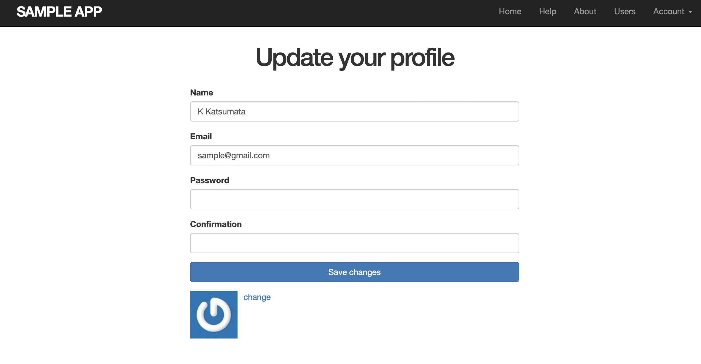

# Railsチュートリアル
# X(旧Twitter)のようなCRUD処理のできるマイクロポストWEBアプリケーションを作成
## 今後、reply機能・通知機能・検索機能を追加予定

## Home
### ログイン前のHome画面

### ログイン後のHome画面に自身&フォローしているユーザーのFeedを表示

## Profile
### 自身の登録情報を変更できるように実装

## Users
### ログイン後のUsers画面に登録済みユーザーを表示

## User
### User画面に遷移すると該当ユーザーのみのFeedとFollow＆Unfollowボタンを表示

